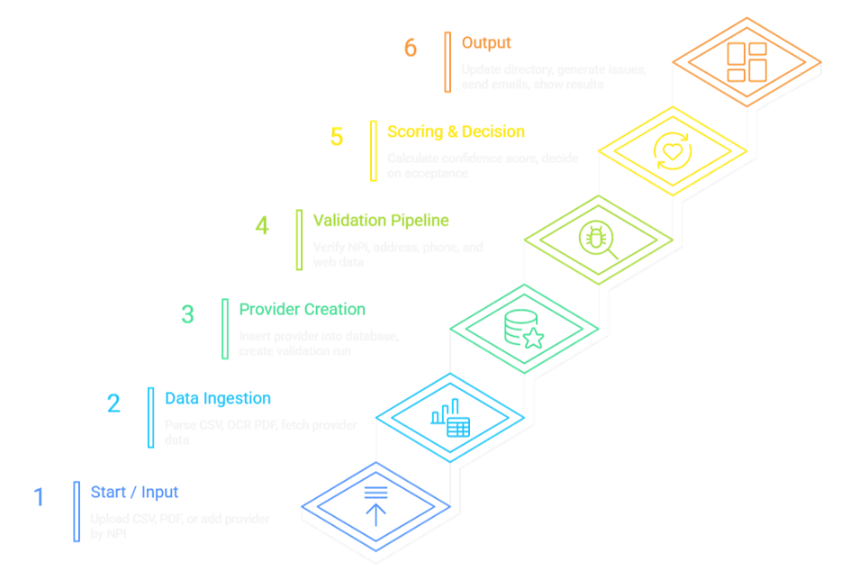

# Validex - Healthcare Provider Data Validation Platform

<div align="center">

**EY Techathon 2025 Submission**  
**Team: Ctrl + Alt + Win**


**Enterprise-grade healthcare provider data validation platform with intelligent web scraping and multi-source verification**

[Features](#features) • [Architecture](#architecture) • [Installation](#installation) • [API Documentation](#api-endpoints) • [Team](#team)

</div>

---

## Overview

**Validex** is an automated healthcare provider directory validation system that addresses the critical challenge of maintaining accurate provider information. The platform leverages multiple authoritative data sources, intelligent algorithms, and real-time web scraping to detect discrepancies, suggest corrections, and ensure data integrity across healthcare organizations.

### Problem Statement

Healthcare organizations rely on provider directories that often contain outdated or incorrect contact, license, and availability information. Manual verification is slow and error-prone, leading to failed appointments, compliance risks, and poor patient experience. An automated, intelligent validation system is needed to ensure accurate, reliable, and up-to-date provider data.

### Key Capabilities

**Automated Web Scraping** - Real-time data extraction from NPI Registry and healthcare directories  
**Multi-Source Validation** - Cross-reference verification from government APIs, Azure Maps, and web sources  
**Intelligent Scoring** - Confidence-based discrepancy detection with weighted source reliability  
**OCR Processing** - Azure Vision AI for automated scanned document parsing  
**Email Notifications** - Automated validation reports via SendGrid integration  
**Real-time Dashboard** - Comprehensive UI for validation management and issue tracking

---

## System Architecture


The platform implements a modular agent-based architecture with specialized validation services:

**PDF Ingestion Service** - Azure OCR for automated document parsing  
**Data Validation Agent** - NPI Registry verification and cross-checking  
**Info Enrichment Agent** - Multi-source web scraping orchestration  
**Quality Assurance Agent** - Intelligent discrepancy detection with confidence scoring  
**Directory Management Agent** - Automated status determination and workflow  
**Email Generation Agent** - SendGrid-powered notification system

---

## Validation Workflow



### Pipeline Stages

1. **Upload** - Import provider data via CSV or scanned PDF documents
2. **Extract** - Azure Vision OCR processes and parses document content
3. **Validate** - Verify against NPI Registry official government database
4. **Enrich** - Execute parallel web scraping from multiple authoritative sources
5. **Analyze** - Apply intelligent comparison algorithms with weighted scoring
6. **Report** - Generate detailed discrepancy reports with confidence metrics
7. **Notify** - Send automated email alerts to administrators and providers

---

## Features

### Multi-Source Data Validation

**NPI Registry API** - Official CMS.gov government healthcare provider database  
**Azure Maps** - Geographic validation and address standardization  
**Azure POI** - Business location and contact information enrichment  
**Web Scraping** - Automated healthcare directory data extraction  
**Custom Sources** - License verification and appointment availability tracking

### Intelligent Validation Engine

**Confidence Scoring** - Weighted source reliability algorithm (NPI: 45%, Azure: 35%, Web: 20%)  
**Address Similarity** - Advanced fuzzy matching with normalization  
**Phone Normalization** - Format-agnostic contact number comparison  
**Specialty Matching** - Handles medical specialty variations and abbreviations

### Validation Issues Management

Each detected discrepancy includes:
- Field identifier (phone, address, license, specialty, certification)
- Current value from uploaded data vs. Suggested value from sources
- Data source attribution (NPI_API, AZURE_MAPS, TRUELENS_WEBSITE, NPI_CERTIFICATIONS)
- Confidence score percentage (0-100%)
- Severity classification (HIGH, MEDIUM, LOW)
- Recommended action (NEEDS_REVIEW, AUTO_ACCEPT, MANUAL_REVIEW)

### Web Scraping Capabilities

Automatically extracts:
- License number, issuing state, and current status
- Office hours and provider availability schedules
- New patient acceptance status
- Telehealth service availability
- Hospital and network affiliations
- Board certifications and specialties
- Comprehensive contact information

---

## Technology Stack

### Backend Infrastructure
- **Node.js** (v20.19.4) with Express.js framework
- **Supabase** - PostgreSQL database with real-time capabilities
- **Azure Cognitive Services** - Vision OCR and document analysis
- **Azure Maps** - Geocoding and address validation API
- **SendGrid** - Transactional email service

### Web Scraping & Automation
- **Axios** - HTTP client for API requests
- **Cheerio** - HTML parsing and data extraction
- **Puppeteer** - Headless browser automation (optional advanced mode)

### Frontend Technologies
- **EJS** - Server-side templating engine
- **Bootstrap** - Responsive UI component framework
- **Vanilla JavaScript** - Client-side interaction and AJAX

---

## Installation Guide

### Prerequisites

- Node.js version 20.x or higher
- npm package manager
- Supabase account and project
- Azure Cognitive Services account
- SendGrid API access

### Setup Instructions

**1. Clone Repository**

```bash
git clone https://github.com/GurumaujSatsangi/validex.git
cd validex
```

**2. Install Dependencies**

```bash
cd backend
npm install
```

**3. Environment Configuration**

Create `.env` file in `backend/` directory with the following variables:

```env
# Supabase Database
SUPABASE_URL=your_supabase_project_url
SUPABASE_ANON_KEY=your_supabase_anon_key

# Azure Cognitive Services
AZURE_VISION_ENDPOINT=https://your-resource.cognitiveservices.azure.com/
AZURE_VISION_KEY=your_azure_vision_key

# Azure Maps
AZURE_MAPS_KEY=your_azure_maps_subscription_key

# SendGrid Email Service
SENDGRID_API_KEY=your_sendgrid_api_key
ADMIN_EMAIL=admin@yourdomain.com

# Server Configuration
PORT=5000
NODE_ENV=development
```

**4. Database Schema Setup**

Execute the database migration scripts in your Supabase SQL editor or via CLI:

```bash
cat backend/migrations/schema.sql | psql $DATABASE_URL
```

**5. Start Application Server**

```bash
cd backend
node index.js
```

Application will be available at `http://localhost:5000`

---

## Usage Guide

### Provider Upload

Navigate to `/upload` endpoint to import provider data. System supports:
- CSV file format with provider information
- Scanned PDF documents (processed via Azure OCR)

The platform automatically extracts and structures provider data for validation.

### Validation Execution

1. Click "Validate All" to initiate validation run
2. System processes providers through multi-source verification pipeline
3. Real-time progress tracking during validation
4. View completed validation runs at `/runs` endpoint

### Issue Review & Resolution

Access validation run details to review detected discrepancies:
- Provider name and affected field
- Current value vs. suggested correction
- Data source and confidence percentage
- Accept or reject individual suggestions
- Bulk actions for multiple issues

### Directory Management

Provider management interface at `/providers`:
- View all validated providers
- Filter by status (NEEDS_REVIEW, APPROVED, REJECTED)
- Access detailed provider information
- View complete validation history

---

## API Endpoints

### Provider Management
```
GET    /api/providers              # List all providers
GET    /api/providers/:id          # Get provider details
GET    /api/providers/:id/issues   # Get validation issues
POST   /api/providers/:id/scrape   # Execute web scraping
```

### Validation Runs
```
GET    /api/validation-runs        # List validation runs
GET    /api/validation-runs/:id    # Get run details
GET    /api/validation-runs/:id/issues  # Get run issues
```

### Data Upload
```
POST   /api/upload/csv             # Upload CSV file
POST   /api/upload/pdf             # Upload PDF with OCR processing
```

### Issue Resolution
```
PATCH  /api/issues/:id/accept      # Accept suggested correction
PATCH  /api/issues/:id/reject      # Reject suggestion
```

---

## Web Scraping Configuration

### Healthcare Directory Scraper
**Source:** `https://truelens-appointment-availability.netlify.app/`

**Extracted Data:**
- License information (number, state, status)
- Office hours and scheduling
- Patient acceptance status
- Telehealth service availability
- Hospital affiliations

### NPI Registry Integration
**API:** `https://npiregistry.cms.hhs.gov/api/`

**Extracted Data:**
- Board certifications
- Healthcare taxonomy codes
- Medical specialty classifications
- License details and credentials

---

## Confidence Scoring Algorithm

```javascript
// Source Reliability Weights
NPI_API:        45%  // Official government database
AZURE_MAPS:     35%  // Microsoft geographic validation
WEB_SCRAPING:   20%  // Healthcare directory sources

// Composite Score Calculation
finalScore = (sourceScore × 0.6) + (addressSimilarity × 0.3) + (phoneSimilarity × 0.1)

// Severity Classification
HIGH severity:    confidence < 30%  // Requires manual review
MEDIUM severity:  30% ≤ confidence < 60%  // Suggested automatic review
LOW severity:     confidence ≥ 60%  // High confidence in suggestion
```

---

## Team

### Ctrl + Alt + Win - EY Techathon 2025

**Gurumauj Satsangi**  
Backend Development  
Vellore Institute of Technology (Vellore Campus)  
Email: gurumaujsatsangi@gmail.com  
Phone: 9875691340

**Abhinav Sharma**  
Frontend Development  
Vellore Institute of Technology (Vellore Campus)  
Email: abhinav90682@gmail.com  
Phone: 8077775108

**Vyom Khurana**  
Backend Development & AI Solutions  
Vellore Institute of Technology (Vellore Campus)  
Email: vyomkhurana846@gmail.com  
Phone: 8448016586

---

## Project Information

**Institution:** Vellore Institute of Technology  
**Competition:** EY Techathon 2025  
**Team Name:** Ctrl + Alt + Win  
**Project:** Validex - Healthcare Provider Data Validation Platform

---

## Acknowledgments

- NPI Registry API by Centers for Medicare & Medicaid Services (CMS)
- Microsoft Azure Cognitive Services
- Supabase for database infrastructure
- SendGrid for email delivery services
- Vellore Institute of Technology for support and resources

---

## Contact & Support

For technical inquiries or support requests:
- Email: gurumaujsatsangi@gmail.com
- Repository Issues: [GitHub Issues](https://github.com/GurumaujSatsangi/validex/issues)

---

<div align="center">

**Validex - Ensuring Healthcare Provider Data Accuracy**  
*Built for EY Techathon 2025 by Team Ctrl + Alt + Win*

</div>

